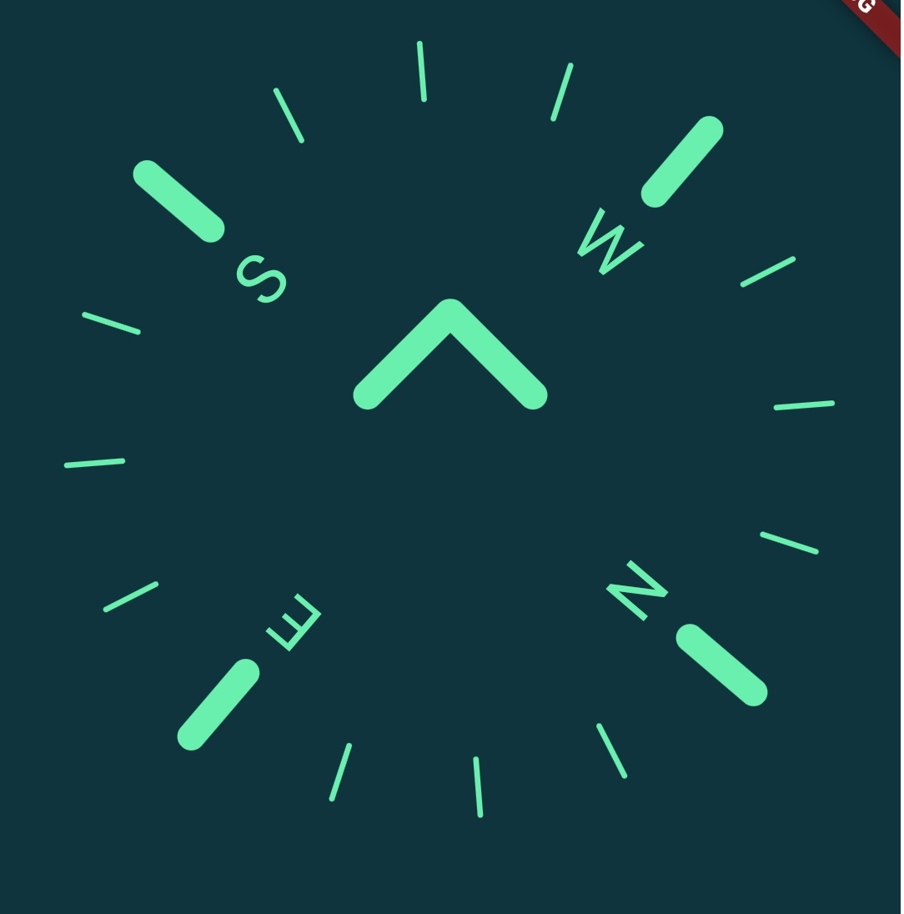

A Widget built on top of [flutter_compass](https://pub.dev/packages/flutter_compass) package.



## Getting started


## Usage

TODO: Include short and useful examples for package users. Add longer examples
to `/example` folder. 

```dart
const like = 'sample';
```

## Additional information

TODO: Tell users more about the package: where to find more information, how to 
contribute to the package, how to file issues, what response they can expect 
from the package authors, and more.
