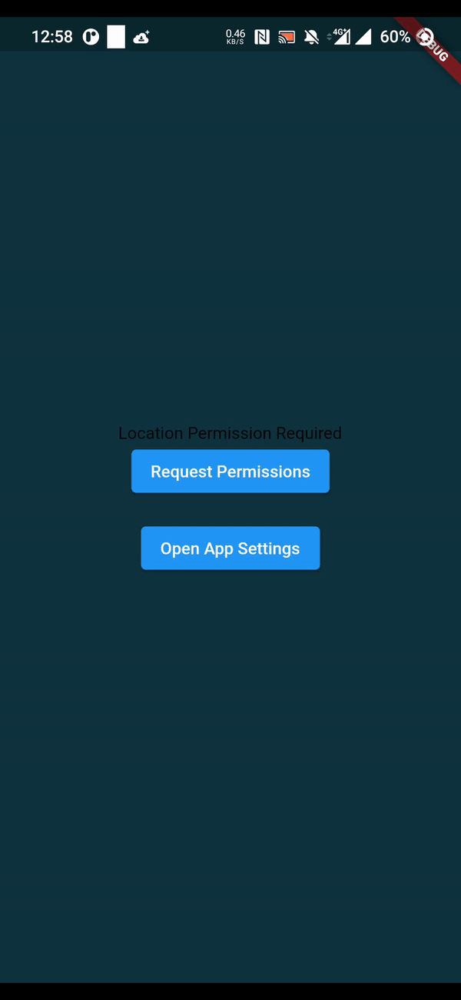
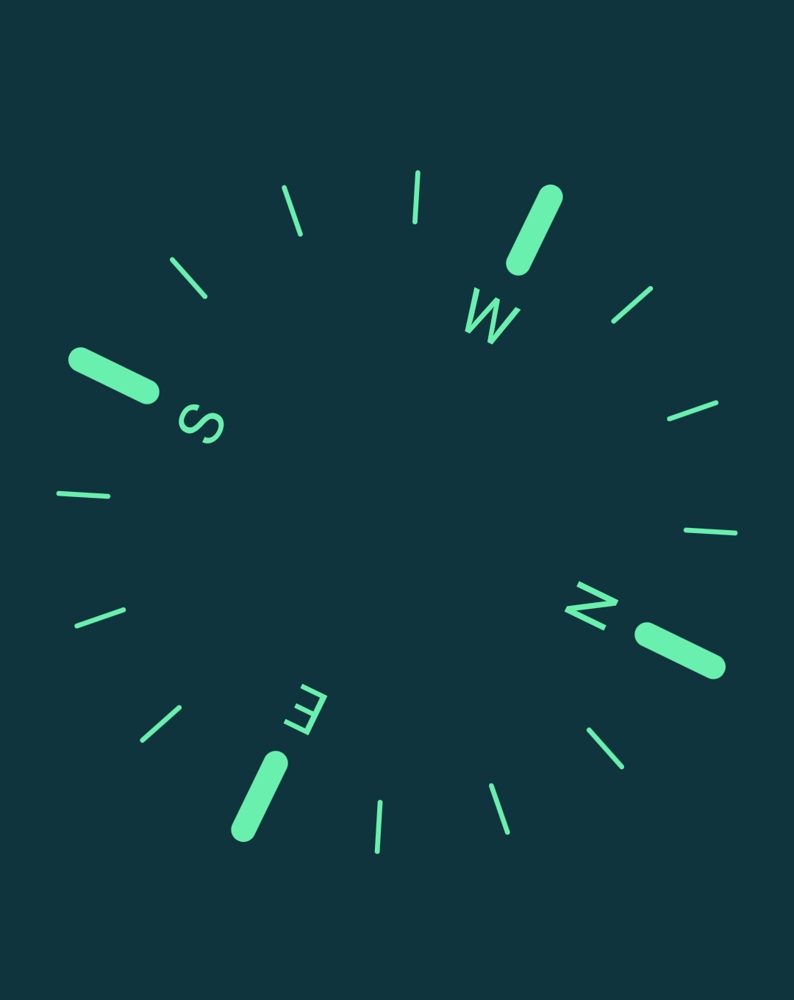

A lightweight Widget built on top of [flutter_compass](https://pub.dev/packages/flutter_compass) package.




## Usage

Add the following to the pubspec.yml file
Can not upload to pub.dev yet due to some [issues](https://github.com/hemanthrajv/flutter_compass/issues/77) with the flutter_compass package.
```yml
dependencies:
  compass_widget:
    git:
      url: https://github.com/MuhammadFahidSarker/compass_widget.git
```

Location is required. Hence, add the following lines to your respective platforms:
## Android - AndroidManifest.xml.xml:
```xml
    <uses-permission android:name="android.permission.INTERNET"/>
    <uses-permission android:name="android.permission.ACCESS_COARSE_LOCATION" />
    <uses-permission android:name="android.permission.ACCESS_FINE_LOCATION" />
```

## iso - Info.plist
```plist
	<key>NSLocationAlwaysAndWhenInUseUsageDescription</key>
	<string>To get location and direction</string>
	<key>NSLocationWhenInUseUsageDescription</key>
	<string>To get location and direction</string>
```

Import the widget in your workspace:
```dart
import 'package:compass_widget/compass_widget.dart';
```

Ask permission using your favourite package:
```dart
//example using permission_handler package
Permission.locationWhenInUse.request().then((value) {
                setState((){
                    locationPermissionGranted = value == PermissionStatus.granted;
                });
              });
```

Create the compass widget in your build method:
```dart
@override
  Widget build(BuildContext context) {
    return locationPermissionGranted ? Compass(
              background: SvgPicture.asset(
                'assets/compass.svg',
                fit: BoxFit.fitWidth,
                width: 400,
                color: Colors.greenAccent,
              ),
              foreground: SvgPicture.asset(
                'assets/needle.svg',
                fit: BoxFit.fitWidth,
                width: 400,
                color: Colors.greenAccent,
              ),
            ):_buildPermissionTaker();
  }
```

And thats pretty much it.
[View Full Example here.](https://github.com/MuhammadFahidSarker/compass_widget/blob/master/example/lib/main.dart)


# Documentation
## Parameters:
<table style="border-collapse: collapse; width: 100%;" border="1">
<tbody>
<tr>
<td style="width: 25%;">Name</td>
<td style="width: 25%;">Type</td>
<td style="width: 25%;">Description</td>
<td style="width: 25%;">Example</td>
</tr>
<tr>
<td style="width: 25%;">background</td>
<td style="width: 25%;">Widget</td>
<td style="width: 25%;">The Rotating part of the compass. Usually the markings of N,E,W,S</td>
<td style="width: 25%;"></td>
</tr>
<tr>
<td style="width: 25%;">foreground</td>
<td style="width: 25%;">Widget</td>
<td style="width: 25%;">The non-moving part of the compass. Usually the needle</td>
<td style="width: 25%;"></td>
</tr>
<tr>
<td style="width: 25%;">loading</td>
<td style="width: 25%;">Widget? [optional, default: CircularProgressIndicator()]</td>
<td style="width: 25%;">Displays this widget when initializing</td>
<td style="width: 25%;">CircularProgressIndicator()</td>
</tr>
<tr>
<td style="width: 25%;">noSensorFound</td>
<td style="width: 25%;">Widget? [optional, default: Text("No Sensors Available")]</td>
<td style="width: 25%;">Displays this widget if no sensor is found (Android Only)</td>
<td style="width: 25%;">Text('No Sensors found');</td>
</tr>
<tr>
<td style="width: 25%;">diff</td>
<td style="width: 25%;">double [optional, default: 0.5]</td>
<td style="width: 25%;">If the difference between last angle and current angle is greater than diff, re-render the conpass.</td>
<td style="width: 25%;">0.5</td>
</tr>
<tr>
<td style="width: 25%;">onNoSensorFound</td>
<td style="width: 25%;">Function? [optional, default:null]</td>
<td style="width: 25%;">Callback function in case no sensor is available on the device (Android Only)</td>
<td style="width: 25%;">-</td>
</tr>
<tr>
<td style="width: 25%;">onAccuracyChanged</td>
<td style="width: 25%;">Function? [optional, default:null]</td>
<td style="width: 25%;">Callback function for accuracy change. Usually show a dialog here to ask them to re calibrate if the accuracy is too low.</td>
<td style="width: 25%;">&nbsp;</td>
</tr>
</tbody>
</table>
